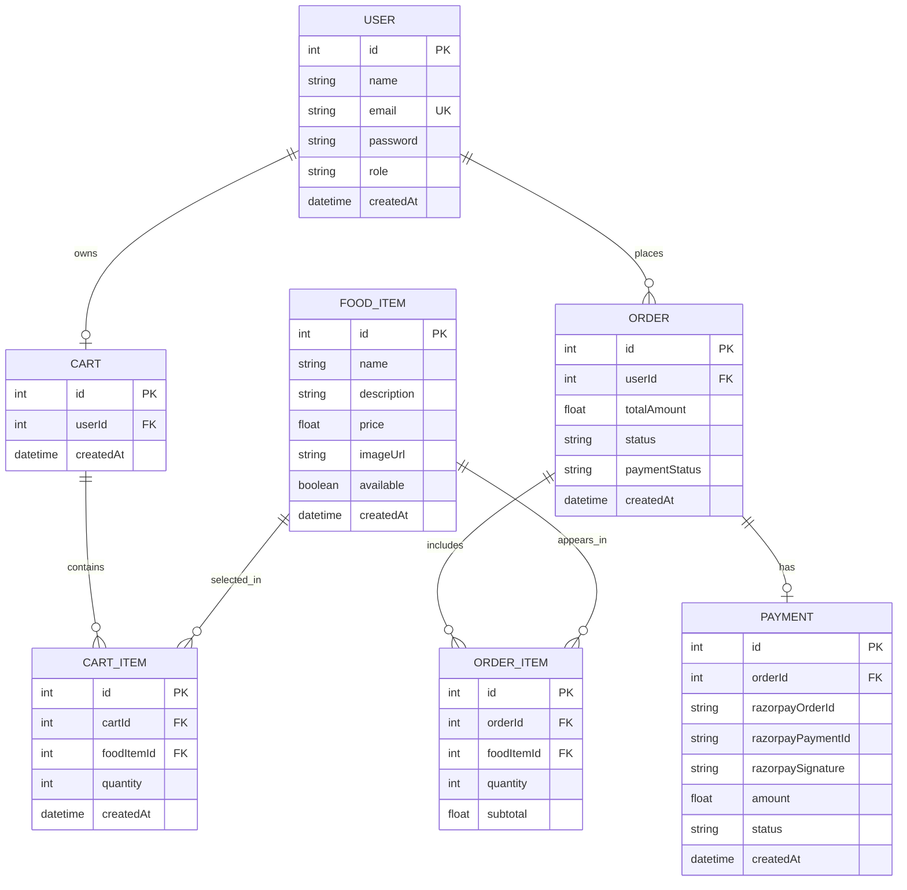
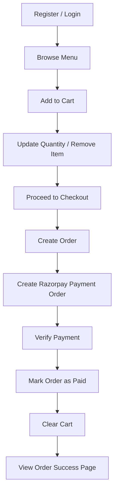
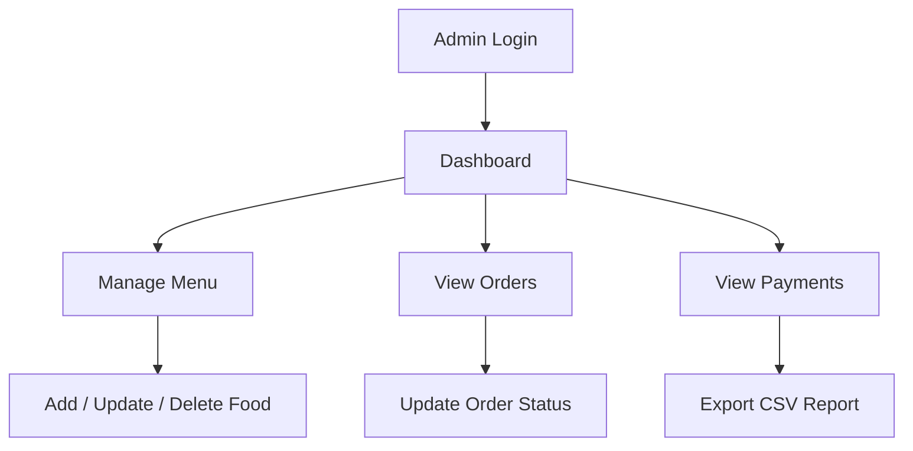

# Meghana Food

Live demo: https://campusfooddelivery.vercel.app/

A full-stack Meghana Food application built for DBMS coursework and practical deployment. The project combines a relational PostgreSQL backend, Prisma ORM, Next.js App Router, secure authentication, cart and order management, Razorpay payments, and admin-side reporting in one workflow-driven system.

1. Store menu data and customer data reliably.
2. Handle cart updates and order placement without data inconsistency.
3. Track payment success and failure.
4. Allow admins to manage menu items and update order states.
5. Maintain a clear order history for users and business reporting for admins.

The core DBMS challenge is to design a system that supports multiple related entities while preserving consistency during cart updates, checkout, payment verification, and status changes.

## System Design

### Architecture Overview

The application follows a simple full-stack architecture:

1. Frontend UI built with Next.js pages and client components.
2. API routes for authentication, cart operations, orders, foods, and payments.
3. Prisma ORM as the data access layer.
4. PostgreSQL as the relational database.
5. Razorpay as the payment gateway.

### ER Diagram

### Schema Summary

The Prisma schema uses the following main entities:

1. `User` stores customer and admin accounts.
2. `FoodItem` stores menu products.
3. `Cart` stores one active cart per user.
4. `CartItem` stores cart line items and quantity.
5. `Order` stores checkout records and business status.
6. `OrderItem` stores the ordered food snapshot and subtotal.
7. `Payment` stores Razorpay transaction metadata and payment verification state.

This design keeps the database normalized enough for clean relationships while still being practical for a food ordering workflow.

## Methodology

### Workflow

The system follows this process:

1. A user registers and a cart record is created automatically.
2. The user logs in and browses available food items.
3. Items are added to the cart and quantities are updated through API calls.
4. Checkout creates an order and order-item records from the cart contents.
5. Razorpay payment is initiated for the calculated total.
6. Payment verification updates the payment and order status.
7. The cart is cleared after successful payment.
8. Admins manage menu items, orders, and payments from protected routes.

### Core Features

Customer features:

1. Register and log in.
2. View available food items.
3. Add items to cart and update quantity.
4. Place an order and pay online.
5. View order history and receipt details.

Admin features:

1. Log in with admin role access.
2. Add, update, disable, or delete food items.
3. View all paid orders.
4. Update order status.
5. View payment records and export transaction data.
6. Monitor revenue and activity from the dashboard.

### Feature Flows

#### Customer Flow

#### Admin Flow

### DBMS Transactions And Integrity

The application demonstrates common DBMS concepts:

1. Primary and foreign key relationships between users, carts, orders, items, and payments.
2. One-to-one and one-to-many relationships.
3. Transaction-like order placement flow where the cart is converted into order records.
4. Referential consistency when cart items and order items depend on their parent records.
5. Role-based access for protecting admin-only operations.

## Result

The final implementation delivers a working Meghana Food platform with a clear DBMS structure and real full-stack functionality. The deployed system supports registration, login, menu browsing, cart management, checkout, payment confirmation, order tracking, and admin reporting. The project is suitable as a database mini project because the schema, relationships, and data flow are explicit and practical.

## Tech Stack

1. Next.js 16 App Router
2. React 19
3. TypeScript
4. Prisma ORM
5. PostgreSQL
6. Razorpay payment gateway
7. Tailwind CSS
8. Framer Motion

## Project Structure

1. `app/` contains pages, admin screens, and API routes.
2. `components/` contains client-side UI and dashboards.
3. `lib/` contains Prisma, auth, constants, and utility helpers.
4. `prisma/` contains the schema and seed script.
5. `types/` contains custom TypeScript declarations.

## Setup And Run

1. Install dependencies with `npm install`.
2. Configure `.env` with `DATABASE_URL`, `NEXTAUTH_SECRET`, `NEXTAUTH_URL`, `RAZORPAY_KEY_ID`, and `RAZORPAY_KEY_SECRET`.
3. Run Prisma migration or push the schema.
4. Generate the Prisma client with `npm run build` or `npx prisma generate`.
5. Start the app with `npm run dev`.

## Deployment Notes

The project is deployed on Vercel at:

https://campusfooddelivery.vercel.app/

For Prisma on Vercel, the build process now regenerates the client before compiling so cached dependencies do not break deployment.

## References

1. Prisma ORM documentation: https://www.prisma.io/docs
2. Next.js documentation: https://nextjs.org/docs
3. Razorpay documentation: https://razorpay.com/docs/
4. PostgreSQL documentation: https://www.postgresql.org/docs/
5. Deployed application: https://campusfooddelivery.vercel.app/
